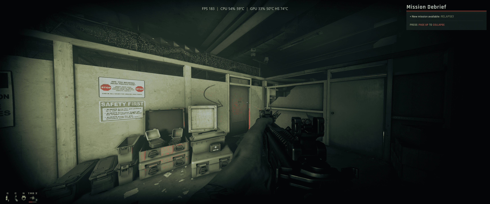

# justFPS - Lightweight Game Performance Monitor

A stripped-down FPS overlay for Windows. Shows the stats you actually want while gaming — nothing more.

   

> **⚠️ Beta Software:** Still being actively worked on. Things may change. Bug reports and feedback appreciated.

> [!CAUTION]
> #### Fullscreen doesn't work with overlays
> Games must be set to **Borderless** or **Borderless Windowed** for the overlay to appear on top. True fullscreen grabs the display exclusively — no overlay can render over it.

## Features

- **FPS** — Real framerate from Windows ETW (works with D3D9-12, OpenGL, Vulkan)
- **GPU** — Utilization, temperature, and hotspot readings (NVIDIA, AMD, Intel via LibreHardwareMonitor)
- **Multi-GPU** — Detects all adapters, pick which one to watch
- **CPU** — Utilization and temperature
- **Active Process** — Shows what game or app is being tracked
- **Horizontal or Vertical Layout** — Pick your orientation
- **Temperature Units** — Celsius or Fahrenheit
- **Custom Hotkeys** — Toggle and settings keys with Ctrl/Alt/Shift modifiers
- **Auto-start Overlay** — Skips config and launches overlay immediately
- **System Tray** — Lives quietly in the background
- **Preset Positions** — Snap to top/bottom left, center, or right
- **Persistent Settings** — Everything saves to config.ini automatically
- **Click-through** — Never steals input from your game
- **Lightweight** — No installer, no services, no junk

## Screenshot



## Why I Built This

All I wanted was a simple FPS counter on screen. That turned into an afternoon of uninstalling bloated tools that do way more than I need.

### What I tried and why I gave up:

| Tool | Why I Ditched It |
|------|------------------|
| **AMD Adrenalin** | Ctrl+/ brings up the overlay, which is great when it works. Problem is it barely works. GPU temp freezes mid-game, CPU usage vanishes for no reason, and half the time the overlay just doesn't appear. All that on top of a suite I never asked for — instant replay, livestreaming, driver-level settings optimizer, and a dozen other features bloating the tray. I don't need a gaming command center, I need a number that stays on screen. |
| **Xbox Game Bar** | Uninstalled it years ago for performance reasons. Windows now refuses to reinstall it. Go figure. |
| **NVIDIA GeForce Experience / Shadowplay / NVIDIA App** | I want an FPS counter, not a full "gaming platform" that optimizes titles, records clips, and runs three background services. |
| **MSI Afterburner** | Great tool, but it ships with overclocking, fan curves, voltage control, and hardware graphs. I just need a number in the corner of my screen. |
| **NZXT CAM** | Bundled with my AIO. Turned into tray bloat that phones home and tries to "enhance my experience." |
| **Steam Overlay** | Decent, but barely any of my library is on Steam. |
| **Overwolf** | I still can't explain what it does. It just slows things down and serves ads. |
| **RivaTuner** | The OG. Respect. But in 2026 I don't need 90% of its feature set. |
| **Fraps** | Last updated in 2013. That says it all. |

### So I built my own:

- **~6MB exe** — One exe, no installers, no background services
- **C++20 + DirectX 11 + Dear ImGui** — About as lean as it gets
- **No accounts, no telemetry, no optimization suites, no social features, no ads — just stats.**

## Download

Grab the latest from the [Releases](../../releases) page, or build from source (see below).

## Usage

1. **Run as Administrator** (needed for ETW game FPS capture)
2. Pick which stats to show
3. Choose position, layout, and hotkeys
4. Hit **Start Overlay**
5. Play your game

### Controls

| Action | How |
|--------|-----|
| Right-click menu | Hold **CTRL** + right-click over the overlay |
| Toggle visibility | Your hotkey (default: **`Ctrl + /`**) |
| Toggle settings | Your hotkey (default: **`Ctrl + *`**) |

> **Note:** CTRL only works while the mouse is over the overlay, so it won't interfere with other apps.

## Why ETW? Why Admin?

Three ways to capture game FPS:

| Method | How it works | Downsides |
|--------|--------------|-----------|
| **DLL Injection** (RivaTuner/Afterburner) | Hooks the game's graphics calls | Can trigger anti-cheat or crash games |
| **Vendor Hooks** (NVIDIA/AMD overlays) | Built into the driver | Ships with gigabytes of bloat |
| **ETW** (Windows Event Tracing) | Kernel-level event provider fires on every frame presentation | Requires administrator rights |

**ETW** wins because:

- **Anti-cheat safe** — never touches the game process
- **Universal** — works across D3D9-12, OpenGL, and Vulkan
- **No injection** — nothing is loaded into the game

Admin is required because ETW is a kernel tracing API. Windows restricts cross-process event access to elevated processes by design. PresentMon and CapFrameX have the same requirement — it's a platform limitation, not a choice.

### Graphics API Compatibility

| API | Supported |
|-----|-----------|
| DirectX 12 | ✅ Yes |
| DirectX 11 | ✅ Yes |
| DirectX 10/10.1 | ✅ Yes |
| DirectX 9 | ✅ Yes (via D3D9 ETW provider) |
| OpenGL | ✅ Yes (via DxgKrnl ETW provider) |
| Vulkan | ✅ Yes (via DxgKrnl ETW provider) |

## Building from Source

### Requirements

- Windows 10 or 11
- Visual Studio 2022+ Build Tools (C++ workload)

### Build

```bash
git clone https://github.com/nathwn12/just-fps.git
cd just-fps
build-msvc.bat
```

Output lands in `build\justFPS.exe` plus required DLLs.

### Bundled Dependencies

- [Dear ImGui](https://github.com/ocornut/imgui) — Immediate-mode GUI
- [LibreHardwareMonitor](https://github.com/LibreHardwareMonitor/LibreHardwareMonitor) — Cross-vendor hardware monitoring
- [lhwm-cpp-wrapper](https://gitlab.com/OpenRGBDevelopers/lhwm-wrapper) — C++ bindings for LibreHardwareMonitor
- DirectX 11 SDK (via Windows SDK)

## Project Structure

```
just-fps/
├── src/
│   ├── main.cpp        # Everything lives here
│   └── resource.rc     # Version info and icon
├── dependencies/       # Gitignored — upstream source + update guide
├── libs/
│   ├── imgui/          # Dear ImGui source
│   └── lhwm/           # LHWM wrapper (single merged DLL, header, lib)
├── build/              # Build artifacts
│   ├── justFPS.exe
│   ├── lhwm-wrapper.dll # Self-contained (all managed deps merged)
│   └── config.ini      # Auto-created on first run
├── icon.ico
├── screenshot.png
├── LICENSE.txt
├── build-msvc.bat
├── justFPS.sln
├── justFPS.vcxproj
└── README.md
```

## Tech Stack

- **Language:** C++20
- **Build:** MSVC (VS 2022 Build Tools)
- **Rendering:** DirectX 11
- **UI:** Dear ImGui
- **FPS Source:** Windows ETW (D3D9, DXGI, DxgKrnl providers)
- **Hardware Stats:** LibreHardwareMonitor (NVIDIA, AMD, Intel)
- **CPU Temp:** LibreHardwareMonitor with WMI fallback
- **Windowing:** Win32 layered transparent window


## License

GNU General Public License v3.0 — see [LICENSE.txt](LICENSE.txt).

## Contributing

Bug reports, feature requests, and PRs welcome.

---

*No bloat. No telemetry. Just stats.*
